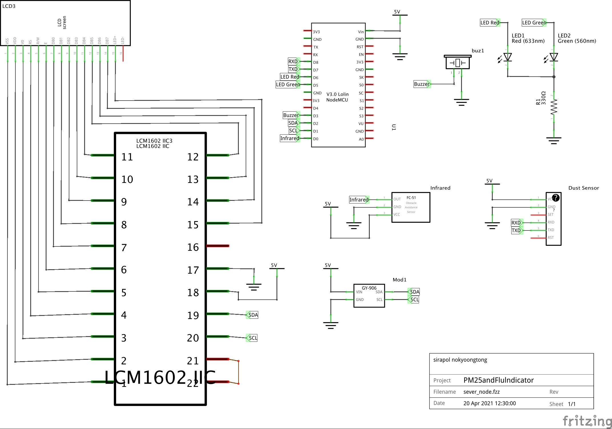
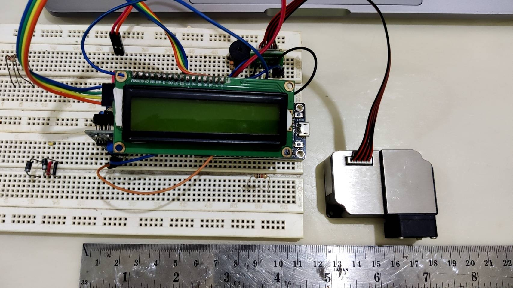
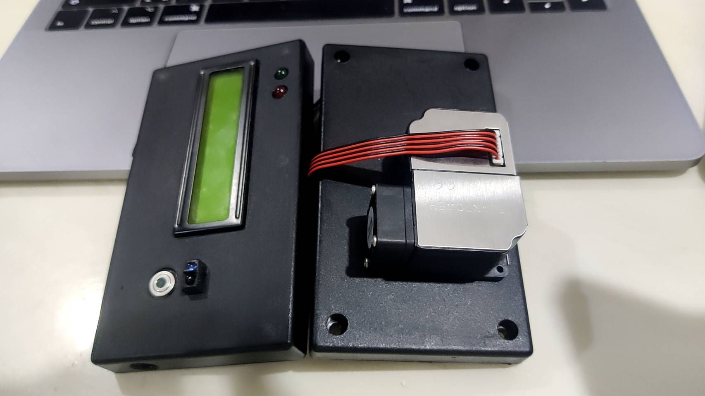

# PM25andFlulndicator
## ภาพรวมโครงการ

โครงการนี้เป็นการจัดทำระบบที่ทำงานหลายฟังก์ชั่นด้วยกัน โดยระบบจะเก็บข้อมูลฝุ่นควัน PM2.5 อุณหภูมิสภาพแวดล้อม และการวัดไข้เมื่อมีสิ่งของเข้ามาใกล้เซนเซอร์ โดยแต่ละฟังก์ชั่นจะมีขั้นตอนการทำงานดังนี้

 1. **ระบบวัดฝุ่นควัน** ตรวจจับฝุ่นควัน และส่งค่าไปยัง AWS Server
 2. **ระบบวัดอุณหภูมิสภาพแวดล้อม** ตรวจจับอุณหภูมิสภาพแวดล้อม และส่งค่าไปยัง AWS Server
 3. **ระบบวัดไข้** ตรวจวัดอุณภูมิสิ่งที่เข้าใกล้เซ็นเซอร์ และแสดงผลอุณหภูมิบนหน้าจอ

ในโครงการนี้จะจัดทำโค้ดสำหรับส่งข้อมูลสองแบบด้วยกัน คือ ใช้ AWS IoT Core สำหรับบริการ PubSub และอีกรูปแบบคือ ใช้ MQTT Server ในการส่งข้อมูล

## อุปกรณ์ที่ใช้

 1. NodeMCU ESP8266
 2. Infrared temperature sensor (GY 906)
 3. Laser dust sensor (PMS 3003)
 4. Tracking sensor (TCRT 5000)
 5. LED ขนาด 5mm
 6. LCD I2C screen ขนาด 16 x2

## แผงวงจร

ให้เดินสายอุปกรณ์และเซนเซอร์ต่างๆ ตามภาพ

  

  

  

## จัดทำโค้ดสำหรับโครงการ

เมื่อจัดทำอุปกรณ์เสร็จแล้ว ให้เลือกโค้ดที่จะใช้เพื่ออัปโหลดลงบอร์ด โดยโค้ดจะอยู่ในโฟลเดอร์ code ซึ่งจะมีโค้ดในรูปแบบ AWS IoT Core และ MQTT Server ให้เลือกใช้ตามที่ต้องการ
